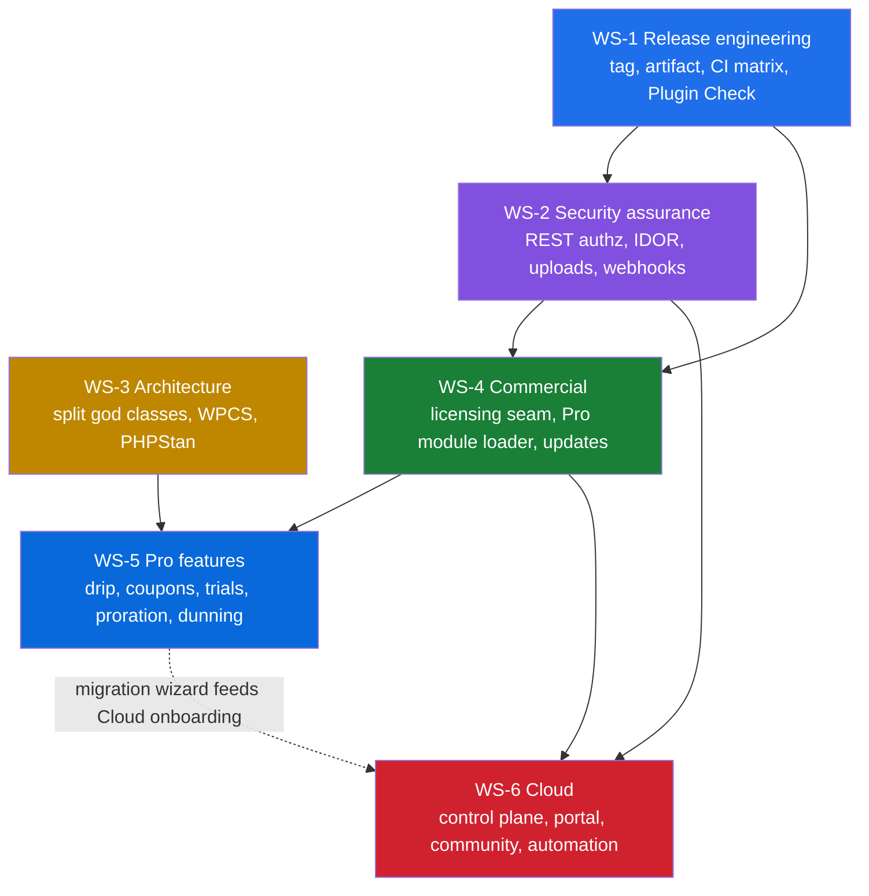

# Memberistic Master Plan

- **Baseline:** Memberistic Membership Solutions 2.0.0
- **Derived from:** the 2026 Master Audit, audit date 2026-08-08
- **Status:** working plan — revised as work lands and as facts change
- **Owner:** Shubo Chandro Sarker

> Planning material. Nothing described here is a shipped feature unless the
> code says so.

---

## 1. The decision this plan rests on

Memberistic 2.0.0 is a strong foundation. It is **not** a mature replacement
for MemberPress, Paid Memberships Pro or WishList Member, and pretending
otherwise would be a positioning mistake that the product cannot yet support.

What it already is, and what competitors mostly are not, is an **operational**
membership system:

- membership data in dedicated tables, not bent out of posts and post meta;
- linked people and family memberships;
- lifecycle statuses that reflect how a real membership business works;
- digital waivers with versioning, re-consent and an immutable archive;
- member documents;
- front-desk check-in, kiosk and QR access workflows;
- corporate and group memberships with seats;
- Stripe subscriptions and the billing portal;
- WooCommerce synchronisation;
- manual and counter payment records;
- transactional lifecycle emails, imports, activity history, staff workflows.

That is a category nobody is currently defending well.

**Position:**

> Memberistic is the membership operating system for WordPress — people, plans,
> recurring billing, protected access, member operations and community from one
> platform.

**Do not** compete on content restriction alone. Compete on membership
operations, a modern member experience, and pricing that is genuinely fair.

**Commercial shape:** a genuinely usable free core, an inexpensive Pro licence,
a limited lifetime option as a cash-flow instrument, and a recurring cloud layer
that carries the margin. Detail in [`04-business-model.md`](04-business-model.md).

---

## 2. Objective and non-goals

### Objective

Take Memberistic from *a strong public foundation* to *a production-grade,
commercially extensible membership platform*, without breaking any existing
membership, payment, linked-person, waiver, check-in, corporate, email, import,
WooCommerce or REST behaviour.

### Non-goals

Written down because each is a plausible mistake, not a straw man.

| Not doing | Why |
|---|---|
| Matching every competitor feature before launch | Feature parity is a losing race from behind. The operational differentiators are the product. |
| Building an LMS/course suite | MemberPress and WishList own it. Integrate; do not rebuild. |
| A full affiliate system in year one | Large surface, low differentiation, well served elsewhere. |
| Replacing WordPress with the cloud tier | WordPress stays the source of truth. Cloud adds what WordPress is bad at. |
| Charging a transaction fee | It is the single clearest promise against the market leader. Giving it up is not recoverable. |
| Cheap unlimited-site lifetime licences | Permanent support and infrastructure liability, no renewal engine. |
| Per-tenant isolated Workers on day one | Real complexity for no day-one benefit. See [`06-saas-architecture.md`](06-saas-architecture.md). |

---

## 3. Invariants

These hold across every workstream in this plan. A change that breaks one is
rejected regardless of its other merits.

| # | Invariant | Enforced by |
|---|---|---|
| I1 | Paid Memberships Pro is never a runtime dependency. It may appear only in documented one-way migration tooling. | `tests/unit/PmproRemovalTest.php` — source scan with a three-file allow-list, each with a stated reason |
| I2 | A fresh install seeds no priced plans, and no plan is silently entitled to free inventory. | `tests/unit/FreshInstallDefaultsTest.php` |
| I3 | Entitlement decisions fail closed. Unprovable entitlement is no entitlement. | `tests/unit/EntitlementServiceTest.php`; `includes/integrations/class-entitlement-service.php` |
| I4 | An expired vendor licence never disables member access, local payments or core operations — only premium modules. | `includes/class-licensing.php` as a seam; to be covered by tests when the Pro layer lands (see backlog P1-3) |
| I5 | A fresh activation makes no outbound HTTP request at all. Integrations default to off. | `Integrations\Integrations_Registry` defaults; needs an explicit regression test (backlog P0-10) |
| I6 | Every REST route has a real `permission_callback`. `__return_true` is banned. Webhooks authenticate by signature before parsing. | `includes/rest/class-rest-controller.php`; needs route-by-route coverage (backlog P0-5) |
| I7 | Site owners keep and can export their membership data. | `includes/class-privacy.php`, CSV export, GDPR exporter/eraser |
| I8 | No edits to WordPress or WooCommerce core, and no vendored copies. | Review |

I4, I5 and I6 are currently upheld by design and by code reading rather than by
tests. Closing that gap is P0 work, not a formality — an invariant nothing
tests is a preference.

---

## 4. Where the product actually stands

Condensed from [`01-audit-findings.md`](01-audit-findings.md).

**Verified by static analysis at 2026-08-08:** all 85 PHP files pass `php -l`;
all 11 shipped scripts pass `node --check`; no `eval`/`exec`/`shell_exec`/
`system`/`passthru`/`proc_open` or unsafe `unserialize`; no REST route using
`__return_true`; nonces, sanitization and escaping used broadly; Stripe webhook
HMAC verification with a replay window; WooCommerce webhook rejecting an empty
shared secret rather than accepting it; secrets masked in REST responses and
overridable by `wp-config.php` constants.

**Not verified:** the claimed 47 tests / 831 assertions could not be reproduced
in the audit environment. That number should be treated as a claim until a CI
run is attached to a release.

**Open problems, by severity:**

| Severity | Problem |
|---|---|
| **P0** | `readme.txt` declares WordPress 6.8 tested; current stable is 7.0.3 (released 2026-08-06), with 7.1 due 2026-08-19 |
| **P0** | No resolvable `v2.0.0` tag, no GitHub Release, no published artifact or checksum |
| **P0** | No route-by-route REST authorization or IDOR test coverage |
| **P0** | No upload/download security test matrix; no webhook fuzzing; no rate-limit tests |
| **P1** | Stripe API pinned at `2024-04-10`; current is `2026-02-25.clover`. Not necessarily broken — pinning is intentional — but the upgrade path is untested |
| **P1** | God classes: corporate 178 KB, waivers 98 KB, Stripe 85 KB, `templates/account.php` 72 KB, memberships REST controller 63 KB |
| **P1** | Coding standards advisory only, on exactly one file |
| **P2** | Licensing is a seam with no implementation; no Pro module loader |

**Missing capability, relative to the market:** community and chat, hosted
custom-domain portal, content drip, mature coupons/trials/proration, gifting,
dunning, abandoned-checkout recovery, affiliate, retention/LTV analytics,
one-click competitor migration, and the cloud control plane. Full cross-match in
[`05-market-position.md`](05-market-position.md).

---

## 5. Workstreams

Six streams. They are not phases — several run concurrently — but they have
hard dependencies on each other.

| ID | Workstream | Question it answers | Detail |
|---|---|---|---|
| **WS-1** | Release engineering | Can we ship a trustworthy artifact, repeatably? | [03](03-quality-and-release.md) |
| **WS-2** | Security assurance | Can we prove access control holds, rather than believe it? | [01](01-audit-findings.md), [03](03-quality-and-release.md) |
| **WS-3** | Architecture | Can the codebase absorb a year of feature work? | [02](02-architecture.md) |
| **WS-4** | Commercial architecture | Can we charge for something without holding members hostage? | [04](04-business-model.md) |
| **WS-5** | Pro growth features | Does the paid tier earn its price? | [04](04-business-model.md), [09](09-execution-backlog.md) |
| **WS-6** | Memberistic Cloud | Where does recurring margin come from? | [06](06-saas-architecture.md) |

### Dependencies

The edges that matter:

- **WS-1 before everything.** Until there is a reproducible tagged artifact,
  nothing else can be shipped, rolled back, or trusted.
- **WS-2 before WS-4 and WS-6.** Charging money and connecting a cloud service
  to a system whose authorization is untested is how a company gets a breach
  instead of a business.
- **WS-3 before WS-5.** Building drip, coupons, trials and proration on top of
  an 85 KB Stripe class and a 63 KB REST controller compounds the problem the
  audit already flagged.
- **WS-4 before WS-5.** A Pro feature with nowhere to be gated is a free
  feature.
- **WS-5 partly feeds WS-6.** The competitor-migration wizard is the strongest
  acquisition path into the cloud tier.

---

## 6. Milestones

Each milestone has entry conditions, exit criteria and a definition of done.
"Done" always includes tests and documentation; it is never "the code works on
my machine."

### M0 — Trustworthy release (weeks 1–4) · WS-1

**Entry:** now.

**Exit criteria**

- [ ] `v2.0.x` tag exists and is immutable
- [ ] GitHub Release published with the production zip attached
- [ ] SHA-256 checksum published
- [ ] Release built from the tag by CI, not by hand
- [ ] Zip verified to contain no `tests/`, `vendor/`, `.github/`, `composer.*`
- [ ] Zip smoke-installed on clean WordPress
- [ ] Tested against WordPress 6.8.x, 6.9.x and 7.0.3 before `Tested up to`
      moves
- [ ] Tested on PHP 8.2, 8.3, 8.4
- [ ] WordPress Plugin Check run; every exception documented
- [ ] Rollback procedure written and validated

**Done when** a stranger can download a versioned artifact, verify its
checksum, install it on current WordPress, and roll back if it goes wrong.

> Partially delivered: `.github/workflows/release.yml` in this repository now
> builds and checksums the artifact and verifies the version string across its
> five homes. The compatibility matrix and Plugin Check remain open.

### M1 — Provable security (weeks 3–8) · WS-2

**Entry:** M0 CI pipeline exists.

**Exit criteria**

- [ ] Every REST route enumerated with method, auth type, capability, and the
      resource it owns
- [ ] Positive **and** negative authorization tests for anonymous, member,
      staff and administrator on every route
- [ ] IDOR tests for every member-owned resource — people, payments, documents,
      waivers, notes, account
- [ ] Upload/download matrix: filename, extension, MIME, path traversal, double
      extensions, SVG policy, storage visibility, authenticated download
- [ ] Webhook fuzzing: bad signature, stale timestamp, duplicate, reordered,
      malformed JSON
- [ ] Rate-limit tests for public/token endpoints, sign-in and guest flows
- [ ] Regression test proving fresh activation makes no outbound HTTP request
- [ ] Secret-redaction test across REST, logs and diagnostic export
- [ ] Dependency/SBOM scanning in CI

**Done when** invariants I5 and I6 are enforced by tests rather than asserted in
prose.

### M2 — Maintainable core (weeks 6–16) · WS-3

**Entry:** M1 test harness exists — refactoring without it is gambling.

**Exit criteria**

- [ ] Stripe split into client, checkout, subscription, billing-portal, webhook
      verifier, webhook handler, reconciliation
- [ ] Waivers split into repository, version, signature, token, reminder,
      document services plus thin controllers
- [ ] Corporate split into group repository, seat/member, invoice/payment-link,
      portal controller, notification services, admin views
- [ ] Memberships REST controller split by resource
- [ ] Characterisation tests written **before** each move; behaviour unchanged
- [ ] WPCS blocking on new and changed code
- [ ] PHPStan at a practical baseline, ratcheting
- [ ] CI matrix across supported WordPress and PHP versions

**Done when** no single class exceeds a defensible size and every split is
covered by tests that existed before the split.

### M3 — Commercial architecture (weeks 12–20) · WS-4

**Entry:** M1 complete; M2 substantially complete.

**Exit criteria**

- [ ] Every 2.0.0 public capability remains in Free — nothing removed to
      manufacture a paid tier
- [ ] Pro implemented as a separate licensing/update add-on, not as core with
      locks
- [ ] Licence state cached; network failure fails **open** for already-licensed
      sites
- [ ] No network call on a visitor-facing request to validate a licence
- [ ] Production domain plus staging/local environment recognition
- [ ] Signed, reproducible update manifest and package process
- [ ] Test proving an expired licence leaves member access and local payments
      untouched (invariant I4)

**Done when** the business can charge money and a lapsed customer's members
still walk through the door.

### M4 — Pro earns its price (months 4–8) · WS-5

**Entry:** M3 complete.

Each feature ships behind its own flag, with tests, independently releasable:
advanced access rules for CPTs/taxonomies/categories and partial content ·
content drip · coupons and promotions · checkout free trials ·
upgrade/downgrade with proration · payment plans · failed-payment dunning ·
abandoned-checkout recovery · gifting · advanced email automation ·
webhook/API automation · MRR/ARR/churn/LTV/cohort analytics · guided importers
from the major membership plugins · social login/SSO extension points.

**Exit criteria**

- [ ] Every feature flag-gated and individually tested
- [ ] Migration wizard covers at least two major competitors end to end
- [ ] Playwright covers the critical journeys listed in
      [`03-quality-and-release.md`](03-quality-and-release.md)

**Done when** a Pro licence is defensible on its feature list alone, without
appealing to the price.

### M5 — Cloud MVP (months 7–12) · WS-6

**Entry:** M3 complete; M1 security assurance extends to the connector.

**Exit criteria**

- [ ] Tenant control plane: organisations, admin users, connected sites,
      subscription state, usage, audit log
- [ ] WordPress connector with HMAC-signed webhooks and idempotency keys, and
      tenant IDs never trusted from the client
- [ ] Portal on `brand.memberistic.app` subdomains, then custom domains via SSL
      for SaaS
- [ ] Directory and announcements
- [ ] Chat on Durable Objects — one object per channel, never one global object
- [ ] Moderation, reporting, blocking, rate limits and retention from day one,
      not after launch
- [ ] Cloud billing and usage metering
- [ ] **A Cloud outage cannot disable local WordPress memberships** — verified
      by test, not by intent

**Done when** a customer can point their own domain at a branded member portal
and losing the cloud costs them the portal, not their business.

---

## 7. Twelve-month shape

| Months | Focus | Milestones |
|---|---|---|
| 1–2 | Release quality, WordPress 7.x, Plugin Check, docs, support workflow, memberistic.com | M0, M1 starts |
| 3–4 | Licensing/update add-on, access rules, drip, coupons, trials, migration wizard, Pro checkout | M1, M2, M3 starts |
| 5–6 | Proration/upgrades, dunning, abandoned checkout, analytics, webhook builder | M3, M4 starts |
| 7–8 | Cloud MVP: control plane, connected sites, portal builder, subdomains, custom domains, basic chat | M5 starts |
| 9–10 | Automations, advanced community, analytics, white label, template library, agency beta | M4, M5 |
| 11–12 | Scale: per-tenant isolated apps *if demand proves it*, partner programme, marketplace foundation | M5+ |

The "if demand proves it" in month 11 is load-bearing. See
[`06-saas-architecture.md`](06-saas-architecture.md) for why per-tenant Workers
are a V2 decision and not a V1 one.

---

## 8. Risk register

| ID | Risk | Trigger | Impact | Mitigation | Owner |
|---|---|---|---|---|---|
| R1 | **Stripe API drift.** Pinned at `2024-04-10`; current is `2026-02-25.clover`. | Stripe deprecates the pinned version, or a needed feature requires a newer one | Payments break — the highest-consequence failure in the product | Contract tests against test-mode fixtures; upgrade through a documented compatibility release; surface the pinned version in System Status; quarterly review task | Maintainer |
| R2 | **WordPress 7.x breakage.** `Tested up to` says 6.8; stable is 7.0.3, and 7.1 ships 2026-08-19. | A user installs on 7.x and hits a regression | Reputation damage at exactly the wrong moment — during acquisition | Run the full matrix before promotion; do not raise `Tested up to` until it passes | Maintainer |
| R3 | **Refactor regressions.** Splitting 178 KB, 98 KB and 85 KB classes touches payments, waivers and group billing. | A behaviour-preserving refactor silently changes behaviour | Silent data or money errors, hardest class of bug to detect | Characterisation tests **before** each move; one module per PR; no feature work inside a refactor PR | Maintainer |
| R4 | **Lifetime licence liability.** LTD sold cheap creates permanent support cost with no renewal. | LTD becomes the default purchase rather than a launch instrument | Support load grows while revenue does not | Cap promotional LTD volume; one production domain; 12 months support included, renewable after | Maintainer |
| R5 | **Cloud coupling.** A cloud outage taking down local memberships. | Local authorization starts depending on a cloud call | Catastrophic and unrecoverable trust loss | WordPress stays source of truth; short-lived entitlement tokens; explicit test that cloud-down leaves local access working | Maintainer |
| R6 | **Free/Pro line drawn wrong.** Removing 2.0.0 capabilities to manufacture Pro. | Pressure to make Pro look worth $79 | Destroys the "free means usable" promise, which is the acquisition engine | Pro is built from *new* value only. Anything public in 2.0.0 stays free — see [`04-business-model.md`](04-business-model.md) | Maintainer |
| R7 | **Untested security assumptions.** Authorization believed correct, never proven. | A researcher or an attacker finds an IDOR first | Breach involving member PII, waivers and payment records | M1 is a gate on M3 and M5, not a parallel nice-to-have | Maintainer |
| R8 | **Scope sprawl.** Chasing competitor feature parity. | Every competitor comparison produces new must-haves | Nothing finishes; differentiators go unfunded | The non-goals table in §2 is the defence. Changing it requires an ADR | Maintainer |
| R9 | **Market data goes stale.** Competitor pricing published on comparison pages ages out. | A comparison page cites a price that changed | Credibility loss, potentially a legal complaint | Everything dated; `sources.md` holds the list; re-verify before publishing | Maintainer |
| R10 | **Single-maintainer concentration.** One person owns every area in CODEOWNERS. | Illness, burnout, or competing priorities | Everything stops | Keep decisions written down (ADRs), keep CI meaningful, keep onboarding docs current — this repository's organisation *is* the mitigation | Maintainer |

---

## 9. Decision log

| Decision | Where |
|---|---|
| Record architecture decisions as ADRs | [ADR 0001](../governance/decisions/0001-record-architecture-decisions.md) |
| Mirror the plugin into a personal repository with full history | [ADR 0002](../governance/decisions/0002-personal-repo-mirror.md) |

Decisions still to be recorded as they are made: the Free/Pro line, the
licensing enforcement model, the cloud data-residency position, the Stripe API
upgrade strategy, and whether Workers for Platforms is ever adopted.

---

## 10. How to use this plan

1. Pick from [`09-execution-backlog.md`](09-execution-backlog.md), not from
   this document. Items there have acceptance criteria.
2. Check §3 before you start. If your change touches an invariant, say so in
   the PR.
3. If you are about to do something this plan says not to, that is fine — but
   write the ADR first, so the next person knows it was a decision rather than
   drift.
